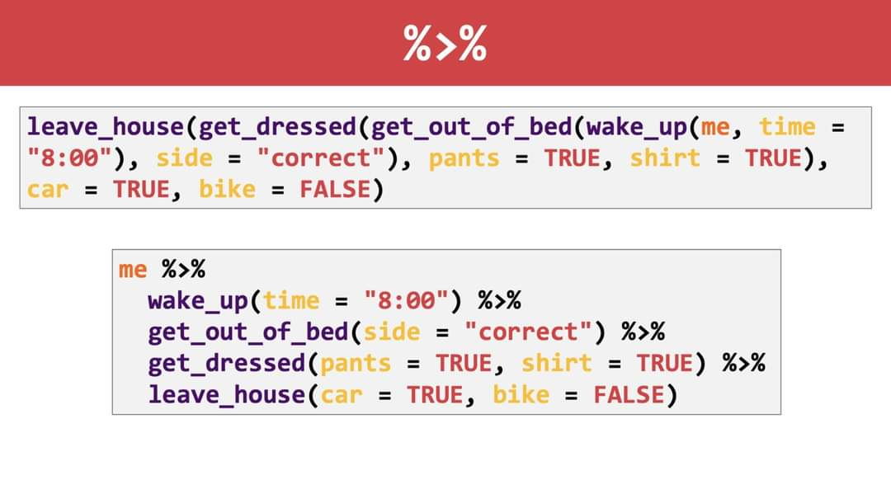

class: inverse, center, middle

```{r setup, include=FALSE}
knitr::opts_chunk$set(fig.dim=c(5.5, 4.5), 
                      # fig.retina=2, 
                      out.width="100%",
                      dev="svg")
library(dplyr)
library(ggplot2)
library(kableExtra)
library(tidyverse,warn.conflicts = F,verbose = F,quietly = T)
library(aweek)
```

```{css echo=FALSE}
.pull-left {
  float: left;
  width: 35%;
}
.pull-right {
  float: right;
  width: 42%;
}
.pull-right ~ p {
  clear: both;
}
```

```{r,echo=FALSE}
df_meta <- readRDS('data/base_metexenicas_noti.rds')

df_meta_1 <- df_meta %>% 
  select(ano, semana, tipo_dx, ubigeo, edad, sexo) %>% 
  slice(1:10)

df_meta_2 <- df_meta %>% 
  select(ano, semana, tipo_dx, ubigeo, edad, sexo) %>% 
  slice(c(10000,10001,10002, 25000,25001,25002, 200000, 200001, 200002, 300000))
df_meta_2$ubigeo[9:10] <- NA
```

# Objetivos:
<br/><br/>
## 1. Aprender a instalar y usar dplyr
### 2. Comprender el uso de las funciones selec, filter y glimpse

---
class: inverse, center, middle

# Objetivos:
<br/><br/>
### 1. Aprender a instalar y usar dplyr
## 2. Comprender el uso de las funciones selec, filter y glimpse

---
class: center, middle

```{r, echo=FALSE, fig.cap="", out.width = '60%'}
knitr::include_graphics("https://thumbs.gfycat.com/GorgeousOrdinaryBooby-max-14mb.gif")
```

---
background-image: url(https://www.libraries.rutgers.edu/sites/default/files/styles/resize_to_300px_width/public/events/2019/09/dplyr.png?itok=yu7MLqqh)
background-size: 100px
background-position: 90% 8%

# Libreria dplyr
Se requiere realizar 2 pasos antes de usar la librería.

---
background-image: url(https://www.libraries.rutgers.edu/sites/default/files/styles/resize_to_300px_width/public/events/2019/09/dplyr.png?itok=yu7MLqqh)
background-size: 100px
background-position: 90% 8%

# Libreria dplyr
Se requiere realizar 2 pasos antes de usar la librería.

### 1. Instalar librería:

```{r, eval = F}
install.packages('dplyr')
```

#### `Nota:`</br>`i) Recuerda que la instalación se hace solo una vez.`</br>`ii) Para instalar las librerias, esta debe estar entre comillas.`

---
background-image: url(https://www.libraries.rutgers.edu/sites/default/files/styles/resize_to_300px_width/public/events/2019/09/dplyr.png?itok=yu7MLqqh)
background-size: 100px
background-position: 90% 8%

# Libreria dplyr
Se requiere realizar 2 pasos antes de usar la librería.

### 1. Instalar librería:

```{r, eval = F}
install.packages('dplyr')
```


#### `Nota:`</br>`i) Recuerda que la instalación se hace solo una vez.`</br>`ii) Para instalar las librerias, esta debe estar entre comillas.`

### 2. Cargar librería:

```{r, eval = F}
library(dplyr)
```

#### `Nota:`</br>`iii) Se debe cargar la librería en cada script que se va usar.`</br>`iv) Se recomienda cargar la librería al empezar a programar ya que no podras usar sus funciones si no lo cargantes antes .`

---
class: highlight, center, middle

# (PARÉNTESIS)
## Uso de operador pipe %>% 
Es útil para concatenar múltiples funciones del dplyr.</br>
Se puede generar con el atajo ***Shift + Ctrl + M***

</br></br>
```{r, echo=FALSE, fig.cap="", out.width = '55%'}

```

---
class: inverse, center, middle

# Veamos las funciones ...

<!-- ################## Seccion select ################## -->
---
layout: true
class: left, top

## Función `select()`

---

.left-column[

## ¿Qué hace?

]

.right-column[

## Esta función nos permitirá seleccionar variables (columnas) de una base de datos (data frame)

]

---

.left-column[

### ¿Qué hace?

## Sintaxis

]

.right-column[

##**DataFrame %>%**
##**&nbsp;&nbsp;&nbsp;&nbsp;&nbsp;&nbsp;&nbsp;&nbsp;&nbsp;select(variable 1, variable 2, ..., variable n)**

]

---

.left-column[
### ¿Qué hace?

### Sintaxis

## Ejemplo 1
]

.right-column[

```{r, eval=F}
df_meta_1
```

]

.pull-left[
### df_meta_1

```{r,echo=FALSE, out.width='30%'}
df_meta_1 %>% 
  kable("html", row.names=FALSE) %>% 
  kable_styling(font_size = 14)  %>%  
  scroll_box(height = "300px", width = "400px")
```
]

.pull-right[

]

---

.left-column[
### ¿Qué hace?

### Sintaxis

## Ejemplo 1
]

.right-column[

```{r, eval=F}
df_meta_1 %>% 
  select(ano, edad)
```

]

.pull-left[
### df_meta_1

```{r,echo=FALSE, out.width='30%'}
df_meta_1 %>% 
  kable("html", row.names=FALSE) %>% 
  kable_styling(font_size = 14)  %>%  
  scroll_box(height = "300px", width = "400px")
```
]

.pull-right[

### `Resultado:` 


]

---

.left-column[
### ¿Qué hace?

### Sintaxis
## Ejemplo 1
]

.right-column[

```{r, eval=F}
df_meta_1 %>% 
  select(ano, edad)
```

]

.pull-left[
### df_meta_1

```{r,echo=FALSE, out.width='30%'}
df_meta_1 %>% 
  kable("html", row.names=FALSE) %>% 
  kable_styling(font_size = 14)  %>%  
  scroll_box(height = "300px", width = "400px")
```
]

.pull-right[

### `Resultado:` 

```{r,echo=FALSE, out.width='30%'}
df_meta_1 %>% 
  select(ano, edad) %>% 
  kable("html", row.names=FALSE) %>% 
  kable_styling(font_size = 14)  %>%  
  scroll_box(height = "300px", width = "200px")
```

]

---

.left-column[
### ¿Qué hace?

### Sintaxis

### Ejemplo 1

## Ejemplo 2

]

.right-column[

```{r, eval=F}
df_meta_1 %>% 
  select(ubigeo, sexo, tipo_dx)
```

]

.pull-left[
### df_meta_1

```{r,echo=FALSE, out.width='30%'}
df_meta_1 %>% 
  kable("html", row.names=FALSE) %>% 
  kable_styling(font_size = 14)  %>%  
  scroll_box(height = "300px", width = "400px")
```
]

.pull-right[


]

---

.left-column[
### ¿Qué hace?

### Sintaxis

### Ejemplo 1

## Ejemplo 2

]

.right-column[

```{r, eval=F}
df_meta_1 %>% 
  select(ubigeo, sexo, tipo_dx)
```

]

.pull-left[
### df_meta_1

```{r,echo=FALSE, out.width='30%'}
df_meta_1 %>% 
  kable("html", row.names=FALSE) %>% 
  kable_styling(font_size = 14)  %>%  
  scroll_box(height = "300px", width = "400px")
```
]

.pull-right[

### `Resultado:`


```{r,echo=FALSE, out.width='30%'}
df_meta_1 %>% 
    select(ubigeo, sexo, tipo_dx) %>% 
  kable("html", row.names=FALSE) %>% 
  kable_styling(font_size = 14)  %>%  
  scroll_box(height = "300px", width = "400px")
```

]

---

.left-column[
### ¿Qué hace?
### Sintaxis
### Ejemplo 1
### Ejemplo 2
## Funciones de ayuda
]

.right-column[

Funciones de ayuda | Uso | Ejemplo 
----------------------------|-------|---------------
- | Excepto la columna |  **`-ubigeo, -sexo`**
: | Columnas entre | **`ano:tipo_dx`**
contains() | Columnas que tienen un string | **`contains('a')`**
starts_with | Columnas que empiezan con un texto | **`starts_with('se')`**
ends_with | Columnas que terminan con un texto | **`'o'`**
one_of() | Columnas cuales nombres estan dentro del vector | **`one_of(c('ano','ubigeo','resultado'))`**

]


---

.left-column[
### ¿Qué hace?
### Sintaxis
### Ejemplo 1
### Ejemplo 2
## Funciones de ayuda
]

.right-column[
Funciones de ayuda | Uso | Ejemplo 
----------------------------|-------|---------------
- | Excepto la columna |  **`-ubigeo, -sexo`**

```{r, eval = F}
df_meta_1 %>% 
    select(-ubigeo, -sexo) 
```

]

.pull-left[
#### df_meta_1
```{r,echo=FALSE, out.width='30%'}
df_meta_1 %>% 
  kable("html", row.names=FALSE) %>% 
  kable_styling(font_size = 14)  %>%  
  scroll_box(height = "300px", width = "400px")
```
]

.pull-right[

#### `Resultado:`
```{r,echo=FALSE, out.width='30%'}
df_meta_1 %>% 
    select(-ubigeo, -sexo) %>% 
  kable("html", row.names=FALSE) %>% 
  kable_styling(font_size = 14)  %>%  
  scroll_box(height = "300px", width = "400px")
```

]

---

.left-column[
### ¿Qué hace?
### Sintaxis
### Ejemplo 1
### Ejemplo 2
## Funciones de ayuda
]

.right-column[

Funciones de ayuda | Uso | Ejemplo 
----------------------------|-------|---------------
: | Columnas entre | **`ano:tipo_dx`**

```{r, eval = F}
df_meta_1 %>% 
    select(ano:tipo_dx) 
```

]


.pull-left[
#### df_meta_1

```{r,echo=FALSE, out.width='30%'}
df_meta_1 %>% 
  kable("html", row.names=FALSE) %>% 
  kable_styling(font_size = 14)  %>%  
  scroll_box(height = "300px", width = "400px")
```
]

.pull-right[

#### `Resultado:`

```{r,echo=FALSE, out.width='30%'}
df_meta_1 %>% 
    select(ano:tipo_dx) %>% 
  kable("html", row.names=FALSE) %>% 
  kable_styling(font_size = 14)  %>%  
  scroll_box(height = "300px", width = "400px")
```

]


---

.left-column[
### ¿Qué hace?
### Sintaxis
### Ejemplo 1
### Ejemplo 2
## Funciones de ayuda
]

.right-column[

Funciones de ayuda | Uso | Ejemplo 
----------------------------|-------|---------------
contains() | Columnas que tienen un string | **`'a'`**

```{r, eval = F}
df_meta_1 %>% 
    select( contains('a') ) 
```

]


.pull-left[
#### df_meta_1

```{r,echo=FALSE, out.width='30%'}
df_meta_1 %>% 
  kable("html", row.names=FALSE) %>% 
  kable_styling(font_size = 14)  %>%  
  scroll_box(height = "300px", width = "400px")
```
]

.pull-right[

#### `Resultado:`

```{r,echo=FALSE, out.width='30%'}
df_meta_1 %>% 
    select( contains('a') ) %>% 
  kable("html", row.names=FALSE) %>% 
  kable_styling(font_size = 14)  %>%  
  scroll_box(height = "300px", width = "400px")
```

]

---

.left-column[
### ¿Qué hace?
### Sintaxis
### Ejemplo 1
### Ejemplo 2
## Funciones de ayuda
]

.right-column[

Funciones de ayuda | Uso | Ejemplo 
----------------------------|-------|---------------
starts_with | Columnas que empiezan con un texto | **`'se'`**

```{r, eval = F}
df_meta_1 %>% 
    select( starts_with('se') ) 
```

]

.pull-left[
#### df_meta_1

```{r,echo=FALSE, out.width='30%'}
df_meta_1 %>% 
  kable("html", row.names=FALSE) %>% 
  kable_styling(font_size = 14)  %>%  
  scroll_box(height = "300px", width = "400px")
```
]

.pull-right[

#### `Resultado:`

```{r,echo=FALSE, out.width='30%'}
df_meta_1 %>% 
    select( starts_with('se') ) %>% 
  kable("html", row.names=FALSE) %>% 
  kable_styling(font_size = 14)  %>%  
  scroll_box(height = "300px", width = "400px")
```

]


---

.left-column[
### ¿Qué hace?
### Sintaxis
### Ejemplo 1
### Ejemplo 2
## Funciones de ayuda
]

.right-column[

Funciones de ayuda | Uso | Ejemplo 
----------------------------|-------|---------------
ends_with | Columnas que terminan con un texto | **`'o'`**

```{r, eval = F}
df_meta_1 %>% 
    select( ends_with('o') ) 
```

]

.pull-left[
#### df_meta_1

```{r,echo=FALSE, out.width='30%'}
df_meta_1 %>% 
  kable("html", row.names=FALSE) %>% 
  kable_styling(font_size = 14)  %>%  
  scroll_box(height = "300px", width = "400px")
```
]

.pull-right[

#### `Resultado:`

```{r,echo=FALSE, out.width='30%'}
df_meta_1 %>% 
    select( ends_with('o') ) %>% 
  kable("html", row.names=FALSE) %>% 
  kable_styling(font_size = 14)  %>%  
  scroll_box(height = "300px", width = "400px")
```

]
---
layout: false
class: inverse, middle, center

# Respiremos un poco ...
<!-- ################## Seccion filter ################## -->
---

layout: true
class: left, top

## Función `filter()`

---

.left-column[

## ¿Qué hace?

]

.right-column[

## Esta función nos permitirá seleccionar observaciones (filas) de una base de datos a partir de una o varias condiciones.

]

---

.left-column[

### ¿Qué hace?

## Sintaxis

]

.right-column[

##**DataFrame %>%**
##**&nbsp;&nbsp;&nbsp;&nbsp;&nbsp;&nbsp;&nbsp;&nbsp;&nbsp;filter(condición 1, condición 2, ..., condición n)**

]

---

.left-column[
### ¿Qué hace?

### Sintaxis

## Ejemplo 1
]

.right-column[

```{r, eval=F}
df_meta_2
```

]

.pull-left[
### df_meta_2

```{r,echo=FALSE, out.width='30%'}
df_meta_2 %>% 
  kable("html", row.names=FALSE) %>% 
  kable_styling(font_size = 14)  %>%  
  scroll_box(height = "300px", width = "400px")
```
]

.pull-right[

]

---

.left-column[
### ¿Qué hace?

### Sintaxis

## Ejemplo 1
]

.right-column[

```{r, eval=F}
df_meta_2 %>% 
  filter(ano == 2015, tipo_dx == 'C')
```

]

.pull-left[
### df_meta_2

```{r,echo=FALSE, out.width='30%'}
df_meta_2 %>% 
  kable("html", row.names=FALSE) %>% 
  kable_styling(font_size = 14)  %>%  
  scroll_box(height = "300px", width = "400px")
```
]

.pull-right[

### `Resultado:` 


]

---

.left-column[
### ¿Qué hace?

### Sintaxis
## Ejemplo 1
]

.right-column[

```{r, eval=F}
df_meta_2 %>% 
  filter(ano == 2015, tipo_dx == 'C')
```

]

.pull-left[
### df_meta_2

```{r,echo=FALSE, out.width='30%'}
df_meta_2 %>% 
  kable("html", row.names=FALSE) %>% 
  kable_styling(font_size = 14)  %>%  
  scroll_box(height = "300px", width = "400px")
```
]

.pull-right[

### `Resultado:` 

```{r,echo=FALSE, out.width='30%'}
df_meta_2 %>% 
  filter(ano == 2015, tipo_dx == 'C') %>% 
  kable("html", row.names=FALSE) %>% 
  kable_styling(font_size = 14)  %>%  
  scroll_box(height = "300px", width = "400px")
```

]

---

.left-column[
### ¿Qué hace?

### Sintaxis

### Ejemplo 1

## Ejemplo 2

]

.right-column[

```{r, eval=F}
df_meta_2 %>% 
  select(ubigeo:sexo) %>% 
  filter(sexo == 'M')
```

]

.pull-left[
### df_meta_2

```{r,echo=FALSE, out.width='30%'}
df_meta_2 %>% 
  kable("html", row.names=FALSE) %>% 
  kable_styling(font_size = 14)  %>%  
  scroll_box(height = "300px", width = "400px")
```
]

.pull-right[


]

---

.left-column[
### ¿Qué hace?

### Sintaxis

### Ejemplo 1

## Ejemplo 2

]

.right-column[

```{r, eval=F}
df_meta_2 %>% 
  select(ubigeo:sexo) %>% 
  filter(sexo == 'M')
```

]

.pull-left[
### df_meta_2

```{r,echo=FALSE, out.width='30%'}
df_meta_2 %>% 
  kable("html", row.names=FALSE) %>% 
  kable_styling(font_size = 14)  %>%  
  scroll_box(height = "300px", width = "400px")
```
]

.pull-right[

### `Resultado:`


```{r,echo=FALSE, out.width='30%'}
df_meta_2 %>% 
  select(ubigeo:sexo) %>% 
  filter(sexo == 'M') %>% 
  kable("html", row.names=FALSE) %>% 
  kable_styling(font_size = 14)  %>%  
  scroll_box(height = "300px", width = "400px")
```

]

---

.left-column[
### ¿Qué hace?
### Sintaxis
### Ejemplo 1
### Ejemplo 2
## Operadores lógicos
]

.right-column[

Operador lógico | Uso | Ejemplo 
----------------------------|-------|---------------
> | Si x es mayor que y |  **`x > y`**
< | Si x es menor que y | **`x < y`**
>= | Si x es menor o igual que y | **`x >= y`**
<= | Si x es menor o igual que y | **`x <= y`**
== | Si x es igual que y | **`x == y`**
!= | Si x no es igual que y | **`x != y`**
is.na | Si x es NA | **`is.na(x)`**
!is.na | Si x no es NA | **`!is.na(x)`**

]


---

.left-column[
### ¿Qué hace?
### Sintaxis
### Ejemplo 1
### Ejemplo 2
## Operadores lógicos
]

.right-column[
Operador lógico | Uso | Ejemplo 
----------------------------|-------|---------------
>= | Si x es menor o igual que y |  **`edad >=  36`**

```{r, eval = F}
df_meta_2 %>% 
    filter( edad >= 36) 
```

]

.pull-left[
#### df_meta_2
```{r,echo=FALSE, out.width='30%'}
df_meta_2 %>% 
  kable("html", row.names=FALSE) %>% 
  kable_styling(font_size = 14)  %>%  
  scroll_box(height = "300px", width = "400px")
```
]

.pull-right[

#### `Resultado:`
```{r,echo=FALSE, out.width='30%'}
df_meta_2 %>% 
    filter( edad >= 36) %>% 
  kable("html", row.names=FALSE) %>% 
  kable_styling(font_size = 14)  %>%  
  scroll_box(height = "300px", width = "400px")
```

]

---

.left-column[
### ¿Qué hace?
### Sintaxis
### Ejemplo 1
### Ejemplo 2
## Operadores lógicos
]

.right-column[

Operador lógico | Uso | Ejemplo 
----------------------------|-------|---------------
!= |Si x no es igual que y | **`tipo_dx != 'D'`**

```{r, eval = F}
df_meta_2 %>% 
    filter( tipo_dx != 'D') 
```

]


.pull-left[
#### df_meta_2

```{r,echo=FALSE, out.width='30%'}
df_meta_2 %>% 
  kable("html", row.names=FALSE) %>% 
  kable_styling(font_size = 14)  %>%  
  scroll_box(height = "300px", width = "400px")
```
]

.pull-right[

#### `Resultado:`

```{r,echo=FALSE, out.width='30%'}
df_meta_2 %>% 
    filter( tipo_dx != 'D') %>% 
  kable("html", row.names=FALSE) %>% 
  kable_styling(font_size = 14)  %>%  
  scroll_box(height = "300px", width = "400px")
```

]


---

.left-column[
### ¿Qué hace?
### Sintaxis
### Ejemplo 1
### Ejemplo 2
## Operadores lógicos
]

.right-column[

Operador lógico | Uso | Ejemplo 
----------------------------|-------|---------------
!is.na() | Si x no es NA | **`!is.na(ubigeo)`**

```{r, eval = F}
df_meta_2 %>% 
    filter( !is.na(ubigeo) ) 
```

]


.pull-left[
#### df_meta_2

```{r,echo=FALSE, out.width='30%'}
df_meta_2 %>% 
  kable("html", row.names=FALSE) %>% 
  kable_styling(font_size = 14)  %>%  
  scroll_box(height = "300px", width = "400px")
```
]

.pull-right[

#### `Resultado:`

```{r,echo=FALSE, out.width='30%'}
df_meta_2 %>% 
    filter( !is.na(ubigeo) )  %>% 
  kable("html", row.names=FALSE) %>% 
  kable_styling(font_size = 14)  %>%  
  scroll_box(height = "300px", width = "400px")
```

]

---

.left-column[
### ¿Qué hace?
### Sintaxis
### Ejemplo 1
### Ejemplo 2
### Operadores lógicos
## Operadores booleanos
]

.right-column[

Operador booleano | Uso | Ejemplo 
----------------------------|-------|---------------
& | A y B son verdaderos |  **`A & B`**
I | A o B es verdadero| **`A I B`**
! | Es A no verdadero | **`!A`**
%in% | Esta X en el grupo compuesto por a, b y c | **`X %in% c(a, b, c)`**
any() | Es verdadero A, B o C | **`any(A, B, C)`**
all() | Es verdadero A, B y C | **`all(A, B, C)`**

]


---

.left-column[
### ¿Qué hace?
### Sintaxis
### Ejemplo 1
### Ejemplo 2
### Operadores lógicos
## Operadores booleanos

]

.right-column[
Operador booleano | Uso | Ejemplo 
----------------------------|-------|---------------
& | A y B son verdaderos |  **`edad > 10 & edad <= 50`**

```{r, eval = F}
df_meta_2 %>% 
    filter( edad > 10 & edad <= 50 ) 
```

]

.pull-left[
#### df_meta_2
```{r,echo=FALSE, out.width='30%'}
df_meta_2 %>% 
  kable("html", row.names=FALSE) %>% 
  kable_styling(font_size = 14)  %>%  
  scroll_box(height = "300px", width = "400px")
```
]

.pull-right[

#### `Resultado:`
```{r,echo=FALSE, out.width='30%'}
df_meta_2 %>% 
    filter( edad > 10 & edad <= 50 ) %>% 
  kable("html", row.names=FALSE) %>% 
  kable_styling(font_size = 14)  %>%  
  scroll_box(height = "300px", width = "400px")
```

]

---

.left-column[
### ¿Qué hace?
### Sintaxis
### Ejemplo 1
### Ejemplo 2
### Operadores lógicos
## Operadores booleanos
]

.right-column[

Operador booleano | Uso | Ejemplo 
----------------------------|-------|---------------
I | A o B son verdaderos | **`ano == 2015 I ano == 2020`**

```{r, eval = F}
df_meta_2 %>% 
    filter( ano == 2015 | ano == 2020) 
```

]


.pull-left[
#### df_meta_2

```{r,echo=FALSE, out.width='30%'}
df_meta_2 %>% 
  kable("html", row.names=FALSE) %>% 
  kable_styling(font_size = 14)  %>%  
  scroll_box(height = "300px", width = "400px")
```
]

.pull-right[

#### `Resultado:`

```{r,echo=FALSE, out.width='30%'}
df_meta_2 %>% 
    filter( ano == 2015 | ano == 2020 ) %>% 
  kable("html", row.names=FALSE) %>% 
  kable_styling(font_size = 14)  %>%  
  scroll_box(height = "300px", width = "400px")
```

]


---

.left-column[
### ¿Qué hace?
### Sintaxis
### Ejemplo 1
### Ejemplo 2
### Operadores lógicos
## Operadores booleanos
]

.right-column[

Operador booleano | Uso | Ejemplo 
----------------------------|-------|---------------
 %in%  | Esta X en el grupo compuesto por a, b y c | **`ubigeo %in% c('200602', '200602', '170103')`**

```{r, eval = F}
df_meta_2 %>% 
    filter( ubigeo %in% c('200602', '200602', '170103') ) 
```

]


.pull-left[
#### df_meta_2

```{r,echo=FALSE, out.width='30%'}
df_meta_2 %>% 
  kable("html", row.names=FALSE) %>% 
  kable_styling(font_size = 14)  %>%  
  scroll_box(height = "250px", width = "400px")
```
]

.pull-right[

#### `Resultado:`

```{r,echo=FALSE, out.width='30%'}
df_meta_2 %>% 
    filter( ubigeo %in% c('200602', '200602', '170103') )  %>% 
  kable("html", row.names=FALSE) %>% 
  kable_styling(font_size = 14)  %>%  
  scroll_box(height = "250px", width = "400px")
```

]


---

layout: false
class: inverse, middle, center

# Antes de terminar ...
<!-- ################## Seccion glimpse ################## -->
---
# Extra: Función `glimpse()`


.left-column[
## ¿Qué hace?

]


.right-column[

## Esta función devuelve una descripción general de sus datos (muy similar a la función str). Por ejemplo tipos de datos, número de variables, número de observaciones, recuento de columnas, el formato de cada columna, etc.

]

---
# Extra: Función `glimpse()`


.left-column[
### ¿Qué hace?
## Sintaxis
]


.right-column[

##**DataFrame %>%**
##**&nbsp;&nbsp;&nbsp;&nbsp;&nbsp;&nbsp;&nbsp;&nbsp;&nbsp;glimpse()**

]


---
# Extra: Función `glimpse()`


.left-column[
### ¿Qué hace?
### Sintaxis
## Comparación con str()
]


.right-column[

```{r, eval = F}
data_meta1
```

]

.pull-left[
#### df_meta_1

```{r,echo=FALSE, out.width='30%'}
df_meta_1 %>% 
  kable("html", row.names=FALSE) %>% 
  kable_styling(font_size = 14)  %>%  
  scroll_box(height = "320px", width = "400px")
```
]

---
# Extra: Función `glimpse()`


.left-column[
### ¿Qué hace?
### Sintaxis
### Comparación con str()
## &nbsp;&nbsp;&nbsp;&nbsp;&nbsp;&nbsp;str()
]


.right-column[

```{r, eval = F}
str(df_meta_1)
```

]

.pull-left[
#### df_meta_1

```{r,echo=FALSE, out.width='30%'}
df_meta_1 %>% 
  kable("html", row.names=FALSE) %>% 
  kable_styling(font_size = 14)  %>%  
  scroll_box(height = "320px", width = "400px")
```
]

.pull-right[

#### `Resultado:`

```{r,echo=FALSE, out.width='20%'}
str(df_meta_1)
```

]

---
# Extra: Función `glimpse()`


.left-column[
### ¿Qué hace?
### Sintaxis
### Comparación con str()
### &nbsp;&nbsp;&nbsp;&nbsp;&nbsp;&nbsp;str()
## &nbsp;&nbsp;&nbsp;&nbsp;&nbsp;&nbsp;glimpse()
]


.right-column[

```{r, eval = F}
df_meta_1 %>% 
  glimpse()
```

]

.pull-left[
#### df_meta_1

```{r,echo=FALSE, out.width='30%'}
df_meta_1 %>% 
  kable("html", row.names=FALSE) %>% 
  kable_styling(font_size = 14)  %>%  
  scroll_box(height = "320px", width = "400px")
```
]

.pull-right[

#### `Resultado:`

```{r,echo=FALSE, out.width='20%'}
df_meta_1 %>% 
  glimpse()
```

]


---
class: highlight, middle, center

# ¡ Gracias por su atención !
## Pasemos a los grupos de prácticas

```{r, echo=FALSE, fig.cap="", out.width = '70%'}
knitr::include_graphics("https://steamuserimages-a.akamaihd.net/ugc/859477345544979042/0A998221D53DC9EA07FB68FA278023D49DCEF44F/")
```


---